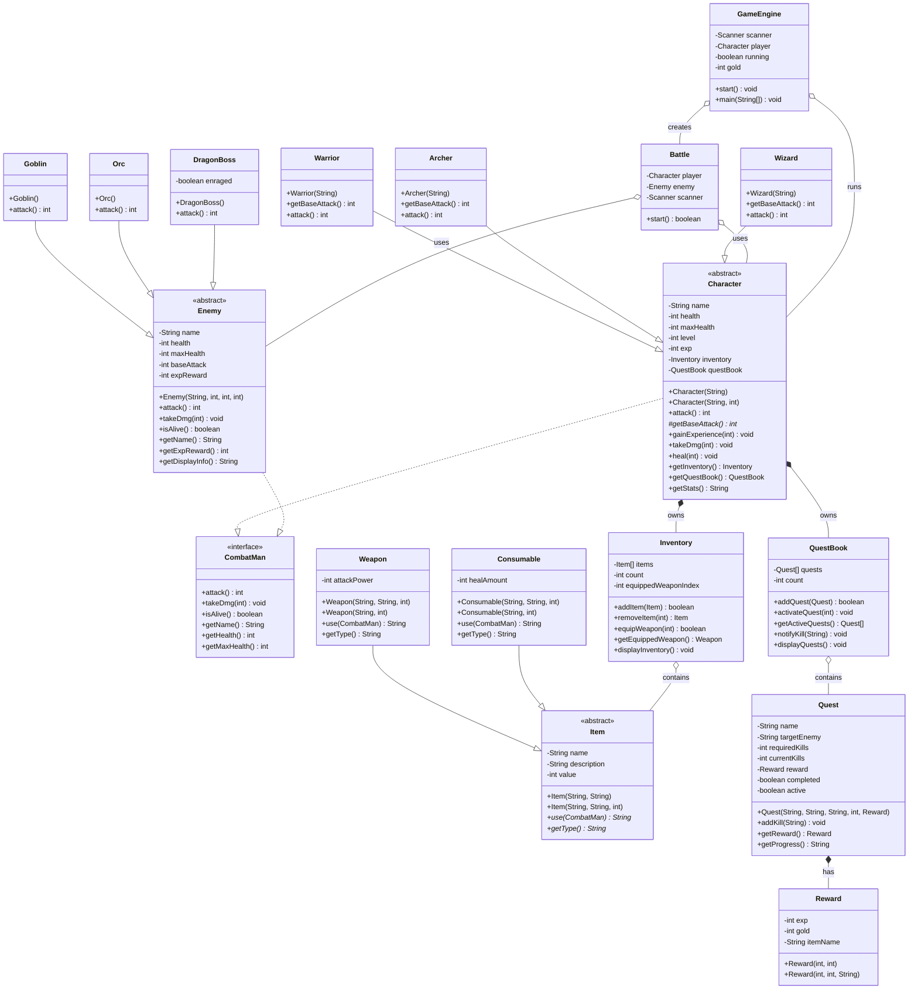

# Kingdom Quest

A turn-based console RPG built in Java demonstrating Object-Oriented Programming principles. Developed as a campus project for **OOP Section 1**.

## Overview

Kingdom Quest is a text-based RPG where players create a character, battle enemies, complete quests, and progress through levels. The game features:

- **3 Character Classes**: Warrior, Archer, Wizard — each with unique abilities
- **3 Enemy Types**: Goblin, Orc, Dragon Boss — with special attack patterns
- **Turn-based Combat**: Attack, use items, or flee
- **Quest System**: Track kill objectives for rewards
- **Shop & Inventory**: Buy weapons and potions, manage equipment
- **Level Progression**: Gain EXP, level up, increase stats

## Documentation

- **[SRS Document (Single File)](SRS_Document.md)** — Software Requirements Specification (combined)
- **[SRS Folder](srs/)** — Detailed SRS with 9 sections:
  - [01 - Introduction](srs/01-introduction.md) — Purpose, Scope, Definitions
  - [02 - Overview](srs/02-overview.md) — Product perspective, functions, architecture
  - [03 - Functional Requirements](srs/03-functional-requirements.md) — All FR specs
  - [04 - OOP Design](srs/04-oop-design.md) — OOP principles with code examples
  - [05 - Class Specifications](srs/05-class-specifications.md) — All 18 classes detailed
  - [06 - Use Cases](srs/06-use-cases.md) — Use case descriptions and diagrams
  - [07 - Non-Functional Requirements](srs/07-non-functional.md) — NFRs
  - [08 - Testing](srs/08-testing.md) — 76 test cases
  - [09 - Appendix](srs/09-appendix.md) — Diagrams, tables, glossary
- **[Video Script](script.md)** — Demonstration script for presentation

## How to Compile & Run

```bash
# Compile
javac -d build/classes -sourcepath src src/GameEngine.java

# Run
java -cp build/classes GameEngine
```

## Game Features

| Feature | Description |
|---------|-------------|
| Character Creation | Choose from 3 classes with unique stats and abilities |
| Exploration | Random enemy encounters with 50% Goblin, 35% Orc, 15% Dragon |
| Turn-based Battle | Attack, use items, view status, or flee |
| Inventory | Store up to 10 items, equip weapons, use consumables |
| Quests | Complete kill-based objectives for EXP, gold, and items |
| Shop | Purchase weapons and potions with earned gold |
| Rest | Restore HP at the inn for gold |
| Leveling | Gain EXP from battles and quests, level up to increase stats |

## Class Architecture & Relationships

---

## Package: `core`

### `CombatMan` (Interface)
The contract for any entity that participates in battle. Defines:
- `attack()` — returns damage dealt
- `takeDmg(int)` — reduces health
- `isAlive()` — checks if still fighting
- `getName()`, `getHealth()`, `getMaxHealth()` — accessors

Implemented by both `Character` and `Enemy`.

### `Battle` (Class)
Manages turn-based combat between one Character and one Enemy. Uses a `Scanner` for player input. Contains the battle loop (`while` both are alive), handles attack, item use, status viewing, and fleeing. Returns `true` if player wins, `false` otherwise.

---

## Package: `model`

### `Character` (Abstract Class, implements `CombatMan`)
Base class for all player archetypes. Encapsulates:
- `name`, `health`, `maxHealth`, `level`, `exp` — core RPG stats
- `inventory` (HAS-A `Inventory`) — items the character carries
- `questBook` (HAS-A `QuestBook`) — active quests

Key behaviors:
- Constructor overloading: `Character(name)` chains via `this()` to `Character(name, maxHealth)`
- `attack()` — calculates base damage + equipped weapon bonus
- `getBaseAttack()` — abstract; each subclass defines its own formula
- `gainExperience(int)` — adds EXP and auto-levels with a `while` loop when crossing thresholds
- `isAlive()` — returns health > 0
- `takeDmg(int)` — reduces health with bounds check
- `heal(int)` — restores health up to max
- All fields `private`, exposed via getters/setters

### `Warrior` (extends `Character`)
- Base HP: 150. Attack formula: `15 + level * 3`
- Overrides `attack()` — 20% chance for critical strike (1.5x damage)

### `Archer` (extends `Character`)
- Base HP: 100. Attack formula: `12 + level * 2`
- Overrides `attack()` — 30% chance for double shot (+50% damage)

### `Wizard` (extends `Character`)
- Base HP: 80. Attack formula: `20 + level * 4`
- Overrides `attack()` — 25% chance for arcane blast (2x damage)

---

## Package: `enemy`

### `Enemy` (Abstract Class, implements `CombatMan`)
Base class for all hostile entities. Encapsulates:
- `name`, `health`, `maxHealth`, `baseAttack`, `expReward`
- `attack()` — base damage with small variance (`Math.random() * 5 - 2`)
- All fields `private` with getters/setters

### `Goblin` (extends `Enemy`)
- HP: 40, ATK: 8, EXP: 25. 20% chance for dirty punch (+5 damage)

### `Orc` (extends `Enemy`)
- HP: 80, ATK: 14, EXP: 50. 15% chance for axe swing (1.8x damage)

### `DragonBoss` (extends `Enemy`)
- HP: 300, ATK: 30, EXP: 200. Transforms at half HP — enters enrage mode (+15 ATK) with 30% fire breath (+20 damage)

---

## Package: `item`

### `Item` (Abstract Class)
Base class for all items. Fields: `name`, `description`, `value` (all `private`). Abstract methods:
- `use(CombatMan target)` — each subclass defines its effect
- `getType()` — returns "Weapon" or "Consumable"
- Constructor chaining via `this()` for optional value parameter

### `Weapon` (extends `Item`)
Adds `attackPower` field. When used, equips to increase character damage. Constructor overloading: two-arg form chains to four-arg with defaults.

### `Consumable` (extends `Item`)
Adds `healAmount` field. When used on a Character, calls `heal()` to restore HP. Constructor overloading: two-arg form chains to three-arg with default description.

### `Inventory` (Class)
HAS-A relationship: Character owns an Inventory. Contains:
- `Item[] items` — fixed-size Java Array (max 10)
- `count` — tracks current number of items
- `equippedWeaponIndex` — tracks actively equipped weapon
- Methods: `addItem()`, `removeItem()`, `equipWeapon()`, `getEquippedWeapon()`, `displayInventory()`
- Uses `for` loops to shift array elements on removal and `instanceof` checks for weapon validation

---

## Package: `progression`

### `Reward` (Class)
Simple data class for quest completion rewards: `exp`, `gold`, `itemName`. Constructor overloading: two-arg (exp, gold) chains to three-arg (exp, gold, itemName).

### `Quest` (Class)
Represents a single quest with: `name`, `description`, `targetEnemy`, `requiredKills`, `currentKills`, `reward` (HAS-A `Reward`), `completed`, `active` flags.
- `addKill(String enemyName)` — increments progress when kill matches target
- `getProgress()` — returns formatted status string

### `QuestBook` (Class)
HAS-A relationship: Character owns a QuestBook. Contains:
- `Quest[] quests` — fixed-size Java Array (max 5)
- `count` — tracks current quests
- Methods: `addQuest()`, `activateQuest()`, `getActiveQuests()`, `notifyKill()` (iterates all quests to update progress)

---

## Package: root

### `GameEngine` (Class)
Main entry point with `main()`. Orchestrates everything:
- Character creation via `switch-case` for class selection
- Main menu loop (`while running`) with 7 options using `switch-case`
- `exploreArea()` — generates random enemies (`if-else` probability chain), starts Battle
- Shop with `Weapon[]` and `Consumable[]` arrays
- Quest reward checking via `for` loop through QuestBook
- All Scanner input wrapped in `try-catch` for `NumberFormatException`

---

## OOP Principles Summary

| Principle | Implementation |
|---|---|
| **Interface** | `CombatMan` — contract for Character and Enemy |
| **Abstract Class** | `Character`, `Enemy`, `Item` — template with abstract methods |
| **Inheritance** | Warrior/Archer/Wizard -> Character; Goblin/Orc/DragonBoss -> Enemy; Weapon/Consumable -> Item |
| **Polymorphism** | `attack()` overridden in all 6 subclasses with unique behavior; `use()` in Weapon vs Consumable |
| **Method Overloading** | Multiple constructors using `this()` in Character, Item, Weapon, Consumable, Enemy, Goblin, Orc, DragonBoss, Reward (+ others) |
| **Encapsulation** | All fields private/protected, accessed exclusively through public getters/setters |
| **Composition (HAS-A)** | Character -> Inventory + QuestBook; Quest -> Reward |
| **Aggregation** | Inventory contains Item[]; QuestBook contains Quest[] |
| **Java Arrays** | `Item[]` in Inventory (size 10), `Quest[]` in QuestBook (size 5), `Weapon[]`/`Consumable[]` for shop display |
| **while loops** | Game main menu loop, battle loop, EXP level-up checking |
| **for loops** | Array iteration in Inventory.removeItem(), QuestBook.notifyKill(), checkQuestRewards(), shop display |
| **if-else / switch** | Menu handling, battle choices, enemy generation probability, gold checks |
| **Operators** | `+`, `-`, `*` (damage/healing math), `>`, `<`, `==` (comparisons), `&&`, `\|\|` (logic), `++`, `+=` (increment) |
| **Exception Handling** | `try-catch` on all `scanner.nextLine()` -> `Integer.parseInt()` calls |

## Class Diagram



## Project Structure

```
src/
├── GameEngine.java          # Entry point, main menu, shop
├── core/
│   ├── CombatMan.java       # Interface for combat
│   └── Battle.java          # Turn-based combat loop
├── model/
│   ├── Character.java       # Abstract base for player
│   ├── Warrior.java         # High HP, crit strikes
│   ├── Archer.java          # Balanced, double shots
│   └── Wizard.java          # Low HP, arcane blast
├── item/
│   ├── Item.java            # Abstract base for items
│   ├── Weapon.java          # Attack power boost
│   ├── Consumable.java      # HP restoration
│   └── Inventory.java       # Item array manager
├── enemy/
│   ├── Enemy.java           # Abstract base for enemies
│   ├── Goblin.java          # Weak, fast
│   ├── Orc.java             # Medium, heavy hits
│   └── DragonBoss.java      # Boss with enrage phase
└── progression/
    ├── Quest.java           # Kill-count objective
    ├── QuestBook.java       # Quest array manager
    └── Reward.java          # EXP, gold, item reward
```
