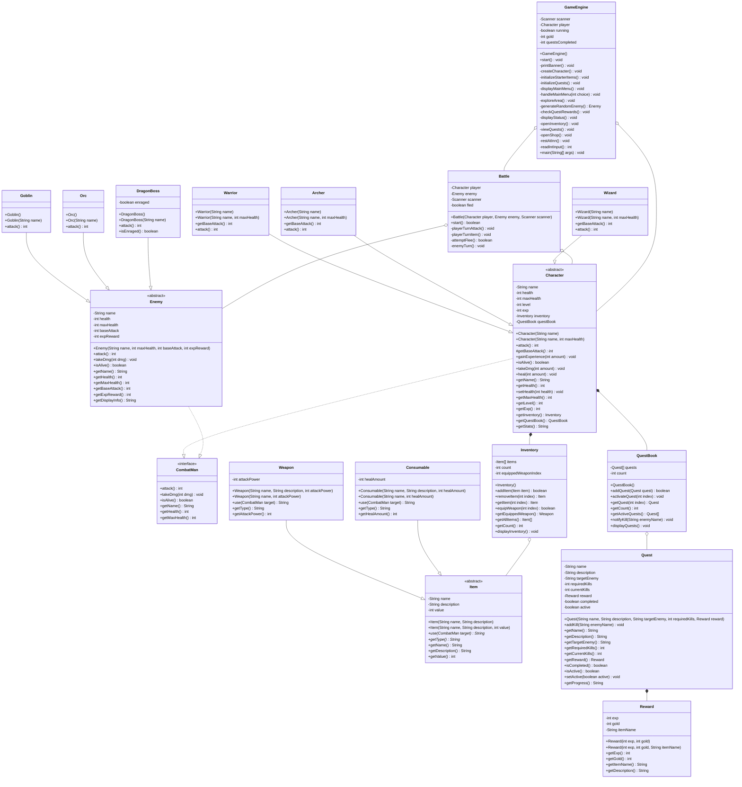

# Kingdom Quest

A turn-based console RPG built in Java demonstrating Object-Oriented Programming principles.

## How to Compile and Run

```bash
javac -d src -sourcepath src src/GameEngine.java
java -cp src GameEngine
```

## Class Diagram



## Project Structure

```
src/
├── GameEngine.java          (main entry point)
├── core/
│   ├── CombatMan.java       (interface)
│   └── Battle.java          (battle simulation)
├── model/
│   ├── Character.java       (abstract base)
│   ├── Warrior.java
│   ├── Archer.java
│   └── Wizard.java
├── item/
│   ├── Item.java            (abstract base)
│   ├── Weapon.java
│   ├── Consumable.java
│   └── Inventory.java
├── enemy/
│   ├── Enemy.java           (abstract base)
│   ├── Goblin.java
│   ├── Orc.java
│   └── DragonBoss.java
└── progression/
    ├── Quest.java
    ├── QuestBook.java
    └── Reward.java
```

## OOP Concepts Demonstrated

| Concept | Where |
|---------|-------|
| Interface | `CombatMan` - contract for all combat entities |
| Abstract Classes | `Character`, `Enemy`, `Item` |
| Inheritance | Warrior/Archer/Wizard extends Character; Goblin/Orc/DragonBoss extends Enemy; Weapon/Consumable extends Item |
| Encapsulation | All fields private, accessed via getters/setters |
| Polymorphism | `attack()` overridden in every subclass with unique behavior |
| Overloading | Multiple constructors via `this()` chaining in Character, Item, Weapon, Consumable, Enemy, Goblin, Orc, DragonBoss |
| HAS-A (Composition) | Character owns Inventory + QuestBook; Inventory holds Item[]; QuestBook holds Quest[]; Quest has Reward |
| Arrays | `Item[]` in Inventory, `Quest[]` in QuestBook, `Weapon[]`/`Consumable[]` in shop |
| Exception Handling | try-catch for NumberFormatException on all Scanner input |
| Flow Control | while loops for menus/battle, for loops for arrays, if-else + switch-case |
