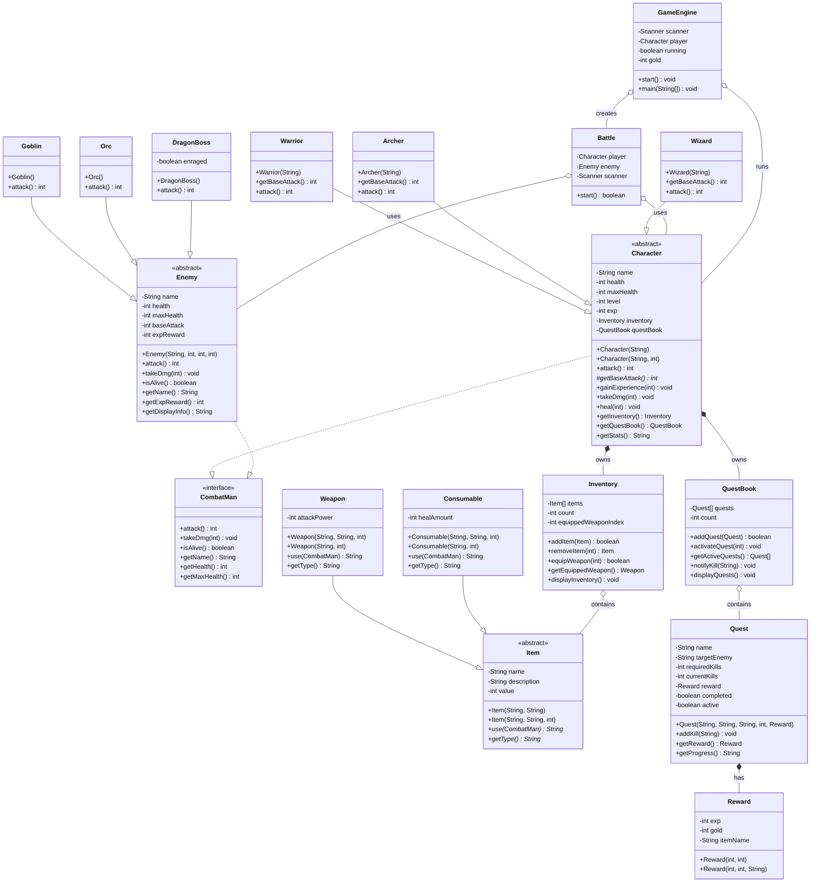

# Software Requirements Specification (SRS)
## Kingdom Quest - Turn-Based Console RPG

**Version**: 1.0  
**Date**: July 2026  
**Author**: Danuk  
**Project Type**: Campus Project - Object-Oriented Programming Section 1

---

## Table of Contents

1. [Introduction](#1-introduction)
2. [Overall Description](#2-overall-description)
3. [Specific Requirements](#3-specific-requirements)
4. [OOP Principles Implementation](#4-oop-principles-implementation)
5. [Class Specifications](#5-class-specifications)
6. [Use Case Descriptions](#6-use-case-descriptions)
7. [Non-Functional Requirements](#7-non-functional-requirements)
8. [Appendices](#8-appendices)

---

## 1. Introduction

### 1.1 Purpose

This Software Requirements Specification (SRS) document describes the functional and non-functional requirements for **Kingdom Quest**, a turn-based console RPG game developed as a campus project for the Object-Oriented Programming Section 1 course. This document serves as a comprehensive reference for understanding the system's architecture, functionality, and OOP implementation.

### 1.2 Scope

Kingdom Quest is a text-based role-playing game where players:
- Create and customize a character from three unique classes
- Engage in turn-based combat with various enemies
- Progress through levels via experience points
- Complete quests for rewards
- Manage inventory and equipment
- Purchase items from a shop

The system consists of **18 Java classes** organized into **5 packages**, demonstrating core Object-Oriented Programming principles.

### 1.3 Definitions, Acronyms, Abbreviations

| Term | Definition |
|------|------------|
| RPG | Role-Playing Game |
| SRS | Software Requirements Specification |
| OOP | Object-Oriented Programming |
| HP | Health Points |
| ATK | Attack Power |
| EXP | Experience Points |
| GUI | Graphical User Interface |
| CLI | Command-Line Interface |
| UML | Unified Modeling Language |

### 1.4 References

- Java SE Documentation
- Object-Oriented Programming Principles
- NetBeans IDE Documentation

### 1.5 Overview

The remainder of this document is organized into sections covering the overall description, specific requirements, OOP principles implementation, class specifications, use case descriptions, and non-functional requirements.

---

## 2. Overall Description

### 2.1 Product Perspective

Kingdom Quest is a standalone console-based application built entirely in Java. It operates as a single-player game with no network dependencies. The game follows a classic RPG archetype system with turn-based combat mechanics.

**System Architecture:**
```
┌─────────────────────────────────────────────────────────────┐
│                      GameEngine                              │
│                    (Main Entry Point)                        │
├─────────────────────────────────────────────────────────────┤
│                                                              │
│  ┌──────────────┐    ┌──────────────┐    ┌──────────────┐   │
│  │    model     │    │    enemy     │    │     item     │   │
│  │  (Characters)│    │  (Enemies)   │    │   (Items)    │   │
│  └──────────────┘    └──────────────┘    └──────────────┘   │
│                                                              │
│  ┌──────────────┐    ┌──────────────┐    ┌──────────────┐   │
│  │     core     │    │ progression  │    │              │   │
│  │  (Combat)    │    │  (Quests)    │    │              │   │
│  └──────────────┘    └──────────────┘    └──────────────┘   │
│                                                              │
└─────────────────────────────────────────────────────────────┘
```

### 2.2 Product Functions

The system provides the following major functions:

1. **Character Creation and Management**
   - Select from three character classes (Warrior, Archer, Wizard)
   - Level progression through experience points
   - Health management (damage and healing)

2. **Combat System**
   - Turn-based battle mechanics
   - Attack with class-specific abilities
   - Item usage during combat
   - Flee mechanic with success probability

3. **Inventory Management**
   - Store up to 10 items
   - Equip weapons for attack bonus
   - Use consumable items for healing

4. **Quest System**
   - Track kill-based objectives
   - Award experience, gold, and items upon completion
   - Support multiple active quests

5. **Shop System**
   - Purchase weapons and consumables
   - Gold-based economy

6. **Rest System**
   - Restore health at the inn for gold

### 2.3 User Classes and Characteristics

| User Type | Description | Technical Expertise |
|-----------|-------------|---------------------|
| Player | Primary user who interacts with the game through console input | Basic computer literacy |

### 2.4 Operating Environment

- **Platform**: Windows/Linux/macOS
- **Runtime**: Java Runtime Environment (JRE) 8 or higher
- **Development IDE**: NetBeans
- **Input Method**: Keyboard (console input)
- **Output Method**: Console/terminal text output

### 2.5 Design and Implementation Constraints

- Must use Java programming language
- Must demonstrate OOP principles (Interface, Abstract Class, Inheritance, Polymorphism, Encapsulation, Composition)
- Must use standard Java Arrays (no Collections framework)
- Must include exception handling for user input
- Console-based interface only (no GUI)
- All fields must be private/protected with public getters/setters

### 2.6 User Documentation

- In-game text menus and prompts
- Status displays for character, inventory, and quests
- Battle feedback messages

---

## 3. Specific Requirements

### 3.1 Functional Requirements

#### 3.1.1 Character Creation (FR-001)

| ID | Requirement |
|----|-------------|
| FR-001.1 | The system shall prompt the user to enter a character name |
| FR-001.2 | The system shall default to "Hero" if no name is entered |
| FR-001.3 | The system shall present three character classes: Warrior, Archer, Wizard |
| FR-001.4 | The system shall initialize the character with class-specific HP values |
| FR-001.5 | The system shall provide starter items (Rusty Sword, 2 Health Potions) |
| FR-001.6 | The system shall initialize three quests upon character creation |

**Class-Specific Stats:**

| Class | Base HP | Attack Formula | Special Ability |
|-------|---------|----------------|-----------------|
| Warrior | 150 | 15 + (level × 3) | 20% chance for Critical Strike (1.5x damage) |
| Archer | 100 | 12 + (level × 2) | 30% chance for Double Shot (+50% damage) |
| Wizard | 80 | 20 + (level × 4) | 25% chance for Arcane Blast (2x damage) |

#### 3.1.2 Main Menu (FR-002)

| ID | Requirement |
|----|-------------|
| FR-002.1 | The system shall display a main menu with 7 options |
| FR-002.2 | Options shall include: Explore, Status, Inventory, Quest Log, Shop, Rest, Quit |
| FR-002.3 | The system shall loop until the user selects Quit |
| FR-002.4 | The system shall handle invalid menu selections gracefully |

#### 3.1.3 Exploration and Combat (FR-003)

| ID | Requirement |
|----|-------------|
| FR-003.1 | The system shall generate a random enemy when exploring |
| FR-003.2 | Enemy spawn rates: Goblin 50%, Orc 35%, Dragon 15% |
| FR-003.3 | The system shall initiate a turn-based battle upon encounter |
| FR-003.4 | Players shall have 4 options per turn: Attack, Use Item, View Status, Flee |
| FR-003.5 | The system shall calculate damage based on character class and equipped weapon |
| FR-003.6 | The system shall award EXP and gold upon enemy defeat |
| FR-003.7 | The system shall update quest progress upon enemy defeat |
| FR-003.8 | The system shall revive the player at half HP upon defeat |

**Enemy Specifications:**

| Enemy | HP | ATK | EXP Reward | Special Ability |
|-------|-----|-----|------------|-----------------|
| Goblin | 40 | 8 | 25 | 20% Dirty Punch (+5 damage) |
| Orc | 80 | 14 | 50 | 15% Axe Swing (1.8x damage) |
| Ancient Dragon | 300 | 30 | 200 | Enrage at 50% HP (+15 ATK), 30% Fire Breath (+20 damage) |

#### 3.1.4 Inventory Management (FR-004)

| ID | Requirement |
|----|-------------|
| FR-004.1 | The system shall support a maximum of 10 items |
| FR-004.2 | The system shall allow equipping weapons from inventory |
| FR-004.3 | The system shall display equipped weapon marker |
| FR-004.4 | The system shall allow using consumable items |
| FR-004.5 | The system shall remove consumables after use |
| FR-004.6 | The system shall shift array elements upon item removal |

#### 3.1.5 Quest System (FR-005)

| ID | Requirement |
|----|-------------|
| FR-005.1 | The system shall support up to 5 active quests |
| FR-005.2 | Each quest shall have a target enemy and required kill count |
| FR-005.3 | The system shall track kill progress automatically |
| FR-005.4 | The system shall mark quests as completed when objectives are met |
| FR-005.5 | The system shall award EXP, gold, and items upon quest completion |

**Quest Specifications:**

| Quest | Target | Kills Required | Rewards |
|-------|--------|----------------|---------|
| Goblin Slayer | Goblin | 3 | 75 EXP, 20 Gold, Iron Shield |
| Orc Cleanup | Orc | 2 | 100 EXP, 40 Gold, Steel Axe |
| Dragon Hunter | Ancient Dragon | 1 | 200 EXP, 100 Gold, Dragon Scale Armor |

#### 3.1.6 Shop System (FR-006)

| ID | Requirement |
|----|-------------|
| FR-006.1 | The system shall display available weapons and consumables |
| FR-006.2 | The system shall check gold balance before purchase |
| FR-006.3 | The system shall deduct gold and add item upon purchase |
| FR-006.4 | The system shall display "Not enough gold" for insufficient funds |

**Shop Inventory:**

| Item | Type | Stat | Price |
|------|------|------|-------|
| Iron Sword | Weapon | ATK +8 | 80 Gold |
| Steel Blade | Weapon | ATK +12 | 120 Gold |
| Enchanted Staff | Weapon | ATK +15 | 150 Gold |
| War Hammer | Weapon | ATK +18 | 180 Gold |
| Health Potion | Consumable | Heal 30 HP | 30 Gold |
| Greater Health Potion | Consumable | Heal 60 HP | 60 Gold |
| Supreme Elixir | Consumable | Heal 100 HP | 100 Gold |

#### 3.1.7 Rest System (FR-007)

| ID | Requirement |
|----|-------------|
| FR-007.1 | The system shall restore full HP when resting |
| FR-007.2 | The system shall charge 10 Gold for resting |
| FR-007.3 | The system shall display error if insufficient gold |

#### 3.1.8 Experience and Leveling (FR-008)

| ID | Requirement |
|----|-------------|
| FR-008.1 | The system shall calculate level-up threshold as level × 100 EXP |
| FR-008.2 | The system shall increase max HP by 25 upon level-up |
| FR-008.3 | The system shall fully restore HP upon level-up |
| FR-008.4 | The system shall handle multiple level-ups from single EXP gain |

#### 3.1.9 Exception Handling (FR-009)

| ID | Requirement |
|----|-------------|
| FR-009.1 | The system shall catch NumberFormatException for all integer inputs |
| FR-009.2 | The system shall display "Invalid input" message for non-numeric entries |
| FR-009.3 | The system shall return -1 for invalid input and handle gracefully |

### 3.2 External Interface Requirements

#### 3.2.1 User Interface

- Text-based console interface
- ASCII art banner for game title
- Formatted menu displays with numbered options
- Clear status and inventory displays

#### 3.2.2 Hardware Interface

- Standard keyboard input
- Console/terminal text output

#### 3.2.3 Software Interface

- Java Standard Library (java.util.Scanner)
- No external dependencies

---

## 4. OOP Principles Implementation

### 4.1 Interface - CombatMan

```java
package core;

public interface CombatMan {
    int attack();
    void takeDmg(int dmg);
    boolean isAlive();
    String getName();
    int getHealth();
    int getMaxHealth();
}
```

**Implementation**: Defines the contract for all combat entities. Implemented by both `Character` and `Enemy` abstract classes, enabling polymorphic battle handling.

### 4.2 Abstract Classes

| Abstract Class | Package | Abstract Methods | Purpose |
|----------------|---------|------------------|---------|
| Character | model | `getBaseAttack()` | Base for player archetypes |
| Enemy | enemy | None | Base for hostile entities |
| Item | item | `use()`, `getType()` | Base for all game items |

### 4.3 Inheritance Hierarchies

**Player Character Hierarchy:**
```
Character (Abstract)
    ├── Warrior
    ├── Archer
    └── Wizard
```

**Enemy Hierarchy:**
```
Enemy (Abstract)
    ├── Goblin
    ├── Orc
    └── DragonBoss
```

**Item Hierarchy:**
```
Item (Abstract)
    ├── Weapon
    └── Consumable
```

### 4.4 Polymorphism

| Method | Override Location | Behavior |
|--------|-------------------|----------|
| `attack()` | Warrior | 20% Critical Strike (1.5x) |
| `attack()` | Archer | 30% Double Shot (+50%) |
| `attack()` | Wizard | 25% Arcane Blast (2x) |
| `attack()` | Goblin | 20% Dirty Punch (+5) |
| `attack()` | Orc | 15% Axe Swing (1.8x) |
| `attack()` | DragonBoss | Enrage mode + 30% Fire Breath |
| `use()` | Weapon | Equip weapon |
| `use()` | Consumable | Heal target |

### 4.5 Method Overloading

| Class | Constructor Overloads | Chaining |
|-------|----------------------|----------|
| Character | `Character(String)`, `Character(String, int)` | `this(name, 100)` |
| Warrior | `Warrior(String)`, `Warrior(String, int)` | `super(name, 150)` |
| Archer | `Archer(String)`, `Archer(String, int)` | `super(name, 100)` |
| Wizard | `Wizard(String)`, `Wizard(String, int)` | `super(name, 80)` |
| Item | `Item(String, String)`, `Item(String, String, int)` | `this(name, desc, 0)` |
| Weapon | `Weapon(String, String, int)`, `Weapon(String, int)` | `this(name, "A trusty weapon", atk)` |
| Consumable | `Consumable(String, String, int)`, `Consumable(String, int)` | `this(name, "Restores health", heal)` |
| Goblin | `Goblin()`, `Goblin(String)` | `super("Goblin", 40, 8, 25)` |
| Orc | `Orc()`, `Orc(String)` | `super("Orc", 80, 14, 50)` |
| DragonBoss | `DragonBoss()`, `DragonBoss(String)` | `super("Ancient Dragon", 300, 30, 200)` |
| Reward | `Reward(int, int)`, `Reward(int, int, String)` | `this(exp, gold, null)` |

### 4.6 Encapsulation

All instance variables are declared `private` or `protected`:

| Class | Private Fields | Public Accessors |
|-------|----------------|------------------|
| Character | name, health, maxHealth, level, exp, inventory, questBook | Getters/Setters for all |
| Enemy | name, health, maxHealth, baseAttack, expReward | Getters/Setters for all |
| Item | name, description, value | Getters/Setters for all |
| Weapon | attackPower | Getter/Setter |
| Consumable | healAmount | Getter/Setter |
| Inventory | items, count, equippedWeaponIndex | Getters + management methods |
| Quest | name, description, targetEnemy, requiredKills, currentKills, reward, completed, active | Getters/Setters |
| QuestBook | quests, count | Getters + management methods |
| Reward | exp, gold, itemName | Getters/Setters |
| DragonBoss | enraged | Getter |

### 4.7 Composition (HAS-A Relationships)

```
Character ──owns──► Inventory
Character ──owns──► QuestBook
Inventory ──contains──► Item[]
QuestBook ──contains──► Quest[]
Quest ──has──► Reward
Battle ──uses──► Character
Battle ──uses──► Enemy
GameEngine ──runs──► Character
```

### 4.8 Java Arrays

| Location | Array Type | Size | Purpose |
|----------|-----------|------|---------|
| Inventory | `Item[]` | 10 | Store player items |
| QuestBook | `Quest[]` | 5 | Store active quests |
| GameEngine | `Weapon[]` | 4 | Shop weapon display |
| GameEngine | `Consumable[]` | 3 | Shop potion display |

### 4.9 Control Structures

| Structure | Usage Location | Purpose |
|-----------|---------------|---------|
| `while` | GameEngine.start() | Main game loop |
| `while` | Battle.start() | Battle loop |
| `while` | Character.gainExperience() | Level-up processing |
| `for` | Inventory.removeItem() | Array element shifting |
| `for` | QuestBook.notifyKill() | Quest progress update |
| `for` | QuestBook.getActiveQuests() | Filter active quests |
| `for` | GameEngine.openShop() | Display shop items |
| `for` | GameEngine.checkQuestRewards() | Check quest completion |
| `switch` | GameEngine.handleMainMenu() | Menu navigation |
| `switch` | Battle.start() | Battle actions |
| `switch` | GameEngine.createCharacter() | Class selection |
| `if-else` | GameEngine.generateRandomEnemy() | Enemy spawn probability |
| `if-else` | GameEngine.restAtInn() | Gold check |
| `if-else` | Battle.attemptFlee() | Flee success check |

### 4.10 Exception Handling

| Location | Exception | Handling |
|----------|-----------|----------|
| GameEngine.readIntInput() | NumberFormatException | Returns -1, displays error |
| Battle.readInt() | NumberFormatException | Returns -1 |

---

## 5. Class Specifications

### 5.1 Core Package

#### 5.1.1 CombatMan (Interface)

**Package**: `core`

**Purpose**: Defines the contract for all entities participating in combat.

**Methods**:
| Method | Return Type | Description |
|--------|-------------|-------------|
| `attack()` | int | Calculate and return damage |
| `takeDmg(int dmg)` | void | Reduce health by damage amount |
| `isAlive()` | boolean | Check if health > 0 |
| `getName()` | String | Return entity name |
| `getHealth()` | int | Return current health |
| `getMaxHealth()` | int | Return maximum health |

#### 5.1.2 Battle

**Package**: `core`

**Purpose**: Manages turn-based combat between a Character and an Enemy.

**Fields**:
| Field | Type | Access | Description |
|-------|------|--------|-------------|
| player | Character | private | The player character |
| enemy | Enemy | private | The enemy being fought |
| scanner | Scanner | private | Input handler |
| fled | boolean | private | Flee status flag |

**Methods**:
| Method | Return Type | Description |
|--------|-------------|-------------|
| `start()` | boolean | Execute battle loop, return true if victory |
| `playerTurnAttack()` | void | Execute player attack |
| `playerTurnItem()` | void | Handle item usage |
| `attemptFlee()` | boolean | Attempt to flee (50% success) |
| `enemyTurn()` | void | Execute enemy attack |
| `readInt()` | int | Parse integer input |

### 5.2 Model Package

#### 5.2.1 Character (Abstract)

**Package**: `model`

**Purpose**: Base class for all player-controlled characters.

**Fields**:
| Field | Type | Access | Default | Description |
|-------|------|--------|---------|-------------|
| name | String | private | - | Character name |
| health | int | private | maxHealth | Current HP |
| maxHealth | int | private | 100 | Maximum HP |
| level | int | private | 1 | Current level |
| exp | int | private | 0 | Current experience |
| inventory | Inventory | private | new | Item container |
| questBook | QuestBook | private | new | Quest tracker |

**Constructors**:
| Constructor | Parameters | Chaining |
|-------------|-----------|----------|
| `Character(String)` | name | `this(name, 100)` |
| `Character(String, int)` | name, maxHealth | - |

**Methods**:
| Method | Return Type | Description |
|--------|-------------|-------------|
| `attack()` | int | Base + weapon damage |
| `getBaseAttack()` | int | Abstract, class-specific formula |
| `gainExperience(int)` | void | Add EXP, handle level-ups |
| `isAlive()` | boolean | health > 0 |
| `takeDmg(int)` | void | Reduce health |
| `heal(int)` | void | Restore health |
| `getStats()` | String | Formatted status string |
| Getters/Setters | Various | Access all fields |

#### 5.2.2 Warrior

**Package**: `model`

**Purpose**: High-HP melee fighter with critical strike ability.

**Stats**: Base HP 150, Attack: 15 + (level × 3)

**Special**: 20% chance for Critical Strike (1.5x damage)

#### 5.2.3 Archer

**Package**: `model`

**Purpose**: Balanced fighter with double shot ability.

**Stats**: Base HP 100, Attack: 12 + (level × 2)

**Special**: 30% chance for Double Shot (+50% damage)

#### 5.2.4 Wizard

**Package**: `model`

**Purpose**: Low-HP magic user with arcane blast ability.

**Stats**: Base HP 80, Attack: 20 + (level × 4)

**Special**: 25% chance for Arcane Blast (2x damage)

### 5.3 Enemy Package

#### 5.3.1 Enemy (Abstract)

**Package**: `enemy`

**Purpose**: Base class for all hostile entities.

**Fields**:
| Field | Type | Access | Description |
|-------|------|--------|-------------|
| name | String | private | Enemy name |
| health | int | private | Current HP |
| maxHealth | int | private | Maximum HP |
| baseAttack | int | private | Base damage |
| expReward | int | private | EXP awarded on defeat |

**Methods**:
| Method | Return Type | Description |
|--------|-------------|-------------|
| `attack()` | int | Base damage ±2 variance |
| `takeDmg(int)` | void | Reduce health |
| `isAlive()` | boolean | health > 0 |
| `getDisplayInfo()` | String | Formatted enemy info |

#### 5.3.2 Goblin

**Package**: `enemy`

**Purpose**: Weak, fast enemy.

**Stats**: HP 40, ATK 8, EXP 25

**Special**: 20% Dirty Punch (+5 damage)

#### 5.3.3 Orc

**Package**: `enemy`

**Purpose**: Medium-strength enemy.

**Stats**: HP 80, ATK 14, EXP 50

**Special**: 15% Axe Swing (1.8x damage)

#### 5.3.4 DragonBoss

**Package**: `enemy`

**Purpose**: Boss enemy with enrage mechanic.

**Stats**: HP 300, ATK 30, EXP 200

**Special**: 
- Enrage at 50% HP (+15 ATK)
- 30% Fire Breath (+20 damage)

### 5.4 Item Package

#### 5.4.1 Item (Abstract)

**Package**: `item`

**Purpose**: Base class for all game items.

**Fields**:
| Field | Type | Access | Description |
|-------|------|--------|-------------|
| name | String | private | Item name |
| description | String | private | Item description |
| value | int | private | Gold value |

**Abstract Methods**:
| Method | Return Type | Description |
|--------|-------------|-------------|
| `use(CombatMan)` | String | Apply item effect |
| `getType()` | String | Return item type |

#### 5.4.2 Weapon

**Package**: `item`

**Purpose**: Equippable attack power boost.

**Additional Field**: `attackPower` (int, private)

**Behavior**: When used, equips to character, adding attackPower to damage.

#### 5.4.3 Consumable

**Package**: `item`

**Purpose**: Usable health restoration item.

**Additional Field**: `healAmount` (int, private)

**Behavior**: When used, heals target Character by healAmount.

#### 5.4.4 Inventory

**Package**: `item`

**Purpose**: Manages player item storage.

**Fields**:
| Field | Type | Access | Default | Description |
|-------|------|--------|---------|-------------|
| items | Item[] | private | new Item[10] | Fixed-size array |
| count | int | private | 0 | Current item count |
| equippedWeaponIndex | int | private | -1 | Equipped weapon index |

**Methods**:
| Method | Return Type | Description |
|--------|-------------|-------------|
| `addItem(Item)` | boolean | Add item if space available |
| `removeItem(int)` | Item | Remove and return item |
| `getItem(int)` | Item | Get item at index |
| `equipWeapon(int)` | boolean | Equip weapon at index |
| `getEquippedWeapon()` | Weapon | Return equipped weapon |
| `getAllItems()` | Item[] | Return all items |
| `displayInventory()` | void | Print inventory contents |

### 5.5 Progression Package

#### 5.5.1 Quest

**Package**: `progression`

**Purpose**: Represents a kill-based objective.

**Fields**:
| Field | Type | Access | Description |
|-------|------|--------|-------------|
| name | String | private | Quest name |
| description | String | private | Quest description |
| targetEnemy | String | private | Required enemy type |
| requiredKills | int | private | Kills needed |
| currentKills | int | private | Current progress |
| reward | Reward | private | Completion reward |
| completed | boolean | private | Completion status |
| active | boolean | private | Active status |

**Methods**:
| Method | Return Type | Description |
|--------|-------------|-------------|
| `addKill(String)` | void | Update progress on kill |
| `getProgress()` | String | Formatted progress string |

#### 5.5.2 QuestBook

**Package**: `progression`

**Purpose**: Manages player quest storage.

**Fields**:
| Field | Type | Access | Default | Description |
|-------|------|--------|---------|-------------|
| quests | Quest[] | private | new Quest[5] | Fixed-size array |
| count | int | private | 0 | Current quest count |

**Methods**:
| Method | Return Type | Description |
|--------|-------------|-------------|
| `addQuest(Quest)` | boolean | Add quest if space available |
| `activateQuest(int)` | void | Activate quest at index |
| `getQuest(int)` | Quest | Get quest at index |
| `getActiveQuests()` | Quest[] | Return active quests |
| `notifyKill(String)` | void | Update all quests on kill |
| `displayQuests()` | void | Print quest log |

#### 5.5.3 Reward

**Package**: `progression`

**Purpose**: Stores quest completion rewards.

**Fields**:
| Field | Type | Access | Description |
|-------|------|--------|-------------|
| exp | int | private | Experience reward |
| gold | int | private | Gold reward |
| itemName | String | private | Item reward (optional) |

**Constructors**:
| Constructor | Parameters | Chaining |
|-------------|-----------|----------|
| `Reward(int, int)` | exp, gold | `this(exp, gold, null)` |
| `Reward(int, int, String)` | exp, gold, itemName | - |

### 5.6 Root Package

#### 5.6.1 GameEngine

**Package**: `root`

**Purpose**: Main entry point, orchestrates all game systems.

**Fields**:
| Field | Type | Access | Default | Description |
|-------|------|--------|---------|-------------|
| scanner | Scanner | private | new | Input handler |
| player | Character | private | null | Player character |
| running | boolean | private | true | Game loop control |
| gold | int | private | 0 | Player currency |
| questsCompleted | int | private | 0 | Completed quest count |

**Methods**:
| Method | Return Type | Description |
|--------|-------------|-------------|
| `start()` | void | Initialize and run game loop |
| `printBanner()` | void | Display game title |
| `createCharacter()` | void | Character creation process |
| `initializeStarterItems()` | void | Provide starting equipment |
| `initializeQuests()` | void | Set up initial quests |
| `displayMainMenu()` | void | Show main menu |
| `handleMainMenu(int)` | void | Process menu selection |
| `exploreArea()` | void | Generate enemy and start battle |
| `generateRandomEnemy()` | Enemy | Create random enemy |
| `checkQuestRewards()` | void | Process completed quests |
| `displayStatus()` | void | Show character stats |
| `openInventory()` | void | Inventory management |
| `viewQuests()` | void | Display quest log |
| `openShop()` | void | Shop interface |
| `restAtInn()` | void | Restore HP |
| `readIntInput()` | int | Parse integer input |

---

## 6. Use Case Descriptions

### 6.1 Use Case: Create Character

| Field | Description |
|-------|-------------|
| **Actor** | Player |
| **Precondition** | Game has started |
| **Main Flow** | 1. System prompts for character name<br>2. Player enters name<br>3. System displays class options<br>4. Player selects class<br>5. System creates character with class stats<br>6. System provides starter items<br>7. System initializes quests |
| **Alternative Flow** | 4a. Player enters invalid choice → System defaults to Warrior |
| **Postcondition** | Character created and ready for gameplay |

### 6.2 Use Case: Explore and Battle

| Field | Description |
|-------|-------------|
| **Actor** | Player |
| **Precondition** | Character exists and is alive |
| **Main Flow** | 1. Player selects "Explore"<br>2. System generates random enemy<br>3. System initiates battle<br>4. Player selects action each turn<br>5. System processes actions and responses<br>6. Battle continues until victory or defeat |
| **Alternative Flow** | 4a. Player flees → 50% success chance<br>6a. Player defeats enemy → Awards EXP and gold<br>6b. Player is defeated → Revives at half HP |
| **Postcondition** | Battle resolved, rewards distributed |

### 6.3 Use Case: Manage Inventory

| Field | Description |
|-------|-------------|
| **Actor** | Player |
| **Precondition** | Character exists |
| **Main Flow** | 1. Player selects "Inventory"<br>2. System displays items<br>3. Player selects action (Equip/Use/Back)<br>4. System processes action |
| **Alternative Flow** | 3a. Equip non-weapon → Error message<br>3b. Use non-consumable → Error message |
| **Postcondition** | Inventory state updated |

### 6.4 Use Case: Purchase Items

| Field | Description |
|-------|-------------|
| **Actor** | Player |
| **Precondition** | Character exists, gold > 0 |
| **Main Flow** | 1. Player selects "Shop"<br>2. System displays items with prices<br>3. Player selects item<br>4. System checks gold balance<br>5. System deducts gold and adds item |
| **Alternative Flow** | 4a. Insufficient gold → Error message |
| **Postcondition** | Item purchased, gold deducted |

### 6.5 Use Case: Complete Quest

| Field | Description |
|-------|-------------|
| **Actor** | Player (automated) |
| **Precondition** | Active quest exists |
| **Main Flow** | 1. Player defeats enemy<br>2. System calls notifyKill()<br>3. System updates quest progress<br>4. If kills >= required, marks complete<br>5. System awards EXP, gold, and item |
| **Postcondition** | Quest completed, rewards distributed |

---

## 7. Non-Functional Requirements

### 7.1 Performance

| ID | Requirement |
|----|-------------|
| NFR-001 | Response time for user input shall be < 100ms |
| NFR-002 | Memory usage shall not exceed 50MB |

### 7.2 Reliability

| ID | Requirement |
|----|-------------|
| NFR-003 | System shall not crash on invalid input |
| NFR-004 | System shall handle all edge cases gracefully |

### 7.3 Usability

| ID | Requirement |
|----|-------------|
| NFR-005 | All menus shall be clearly labeled |
| NFR-006 | Error messages shall be informative |
| NFR-007 | Game state shall be readable at all times |

### 7.4 Maintainability

| ID | Requirement |
|----|-------------|
| NFR-008 | Code shall follow Java naming conventions |
| NFR-009 | Classes shall have single responsibility |
| NFR-010 | Methods shall not exceed 50 lines |

### 7.5 Portability

| ID | Requirement |
|----|-------------|
| NFR-011 | System shall run on any platform with JRE 8+ |
| NFR-012 | No external dependencies required |

---

## 8. Appendices

### 8.1 Project Structure

```
src/
├── GameEngine.java          # Entry point, main menu, shop
├── core/
│   ├── CombatMan.java       # Interface for combat
│   └── Battle.java          # Turn-based combat loop
├── model/
│   ├── Character.java       # Abstract base for player
│   ├── Warrior.java         # High HP, crit strikes
│   ├── Archer.java          # Balanced, double shots
│   └── Wizard.java          # Low HP, arcane blast
├── item/
│   ├── Item.java            # Abstract base for items
│   ├── Weapon.java          # Attack power boost
│   ├── Consumable.java      # HP restoration
│   └── Inventory.java       # Item array manager
├── enemy/
│   ├── Enemy.java           # Abstract base for enemies
│   ├── Goblin.java          # Weak, fast
│   ├── Orc.java             # Medium, heavy hits
│   └── DragonBoss.java      # Boss with enrage phase
└── progression/
    ├── Quest.java           # Kill-count objective
    ├── QuestBook.java       # Quest array manager
    └── Reward.java          # EXP, gold, item reward
```

### 8.2 Class Diagram



### 8.3 System Statistics

| Metric | Value |
|--------|-------|
| Total Classes | 18 |
| Total Packages | 5 |
| Abstract Classes | 3 |
| Interfaces | 1 |
| Concrete Classes | 14 |
| Total Methods | ~80 |
| Estimated LOC | ~650 |

---

**Document End**

*This SRS document was prepared for the Object-Oriented Programming Section 1 campus project.*
